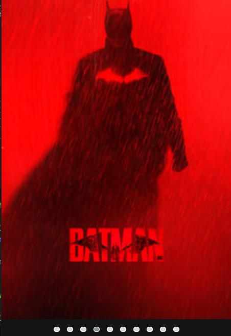

<h1 align="center">
      <a href="#" alt="site-creative"> SIGMAFLIX</a>
</h1>

# Tabela de conteúdos

<!--ts-->

- [Sobre o projeto](#-sobre-o-projeto)
- [Funcionalidades](#-funcionalidades)
- [Layout](#-layout)
  - [Mobile](#mobile)
  - [Web](#web)
- [Tecnologias](#-tecnologias)
  - [WebSite](#user-content-website--react----typescript)
  <!--te-->

## 💻 Sobre o projeto

Sigmaflix e uma recriação da plataforma netflix onde atribuo um catalogo de filmes inspirados no mindset "sigma" um assunto que esta repercutindo nas redes sociais.
Projeto desenvolvido durante o **bootcamp html web developer** oferecida pela [DIO](https://www.dio.me/).

---

## ⚙️ Funcionalidades

- [x] responsividade no design

  - [x] carrosel de filmes
  - [x] informação sobre filme principal
    - sinopse ao escolher um filme no catalogo
    - tela de login com redirecionamento ao filme principal

---

## 🎨 Layout

### Mobile

  

  

### Web

<!-- 

  

  

 -->

---

## 🛠 Tecnologias

As seguintes ferramentas foram usadas na construção do projeto:

#### **Website**

**[html](https://developer.mozilla.org/pt-BR/docs/Web/HTML)**
**[css](https://developer.mozilla.org/pt-BR/docs/Web/CSS)**
**[javascript](https://www.javascript.com/)**
